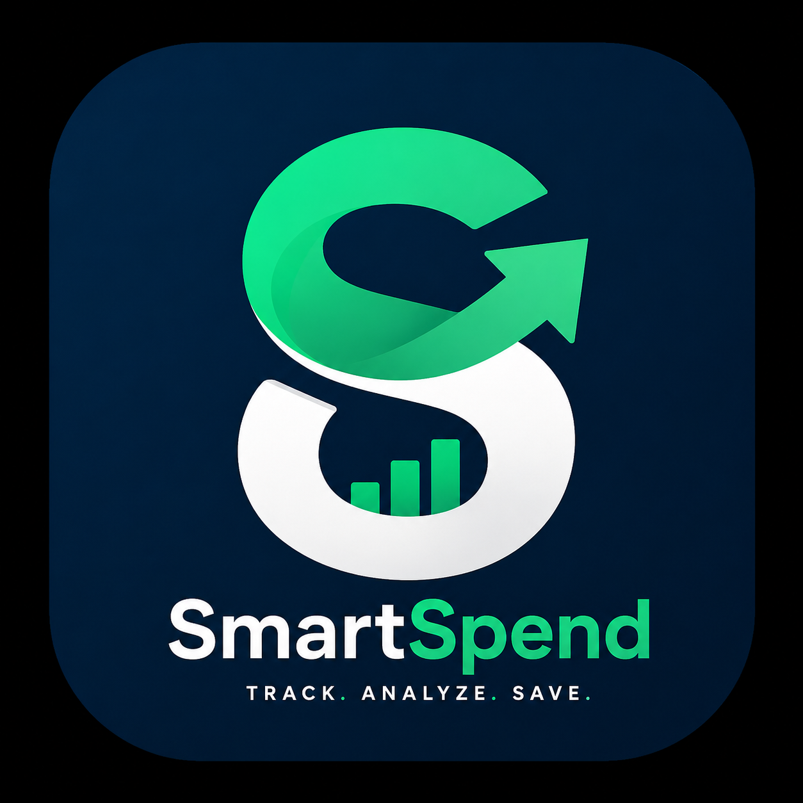

<p align="center">
  
</p>
# SmartSpend 💰

## 📌 Project Overview
SmartSpend is a web application that helps users track, manage, and optimize their spending. It provides a simple interface for monitoring expenses and gaining insights into financial habits.

SmartSpend905 follows a simple full-stack architecture:

The user interacts with a React-based frontend
Financial data (income/expenses) is stored in a cloud database (Supabase)
The UI updates dynamically based on real-time data
The application is deployed as a hosted web app via Lovable


## 📌 Features
💵 Track income and expenses
📊 Visual spending insights (charts/analytics)
🗂️ Category-based expense organization
⚡ Fast and responsive UI
☁️ Cloud-backed data storage
User Authentication & Login System
Secure login and user account management.
Budget Planning Tools
Create and manage budgets to track spending effectively.
Export Data (CSV / PDF Reports)
Download financial reports for offline use and analysis.
Mobile App Version
Optimized experience for mobile devices.
Advanced Analytics Dashboard
Visual insights into spending patterns and financial trends.


## 🧱 Tech Stack
Frontend: React + Vite
Language: TypeScript
UI Components: shadcn/ui
Styling: Tailwind CSS
Backend / Database: Supabase
Deployment: Lovable.app


## How SmartSpend Works

1. 🧾 Create Your Free Account
Sign up in seconds. No card, no stress.

2. ➕ Log Your Transactions
Add income and expenses instantly. SmartSpend automatically categorizes everything.

3. 📊 See Where Your Money Goes
Get clean charts, clear reports, and smart insights that help you save more every month.


## Live Demo

**URL**: https://smartspend905.lovable.app


## What technologies are used for this project?

This project is built with:

- Vite
- TypeScript
- React
- shadcn-ui
- Tailwind CSS


## How can I edit this code?

There are several ways of editing your application.

**Use Lovable**

Simply visit (https://lovable.dev/projects/cbde4349-1bb0-460b-8391-ab3fd20e8c6a and start prompting)

Changes made via Lovable will be committed automatically to this repo.

**Use your preferred IDE**

If you want to work locally using your own IDE, you can clone this repo and push changes. Pushed changes will also be reflected in Lovable.

The only requirement is having Node.js & npm installed - [install with nvm](https://github.com/nvm-sh/nvm#installing-and-updating)

Follow these steps:

```sh
# Step 1: Clone the repository using the project's Git URL.
git clone <YOUR_GIT_URL>

# Step 2: Navigate to the project directory.
cd <YOUR_PROJECT_NAME>

# Step 3: Install the necessary dependencies.
npm i

# Step 4: Start the development server with auto-reloading and an instant preview.
npm run dev
```


## How can I deploy this project?

Simply open (https://lovable.dev/projects/cbde4349-1bb0-460b-8391-ab3fd20e8c6a) and click on Share -> Publish.


